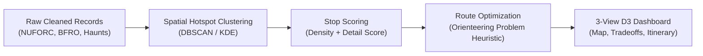
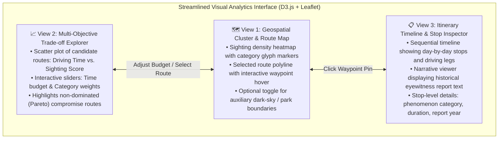

# 🗺️ Interactive Visual Analytics for Multi-Objective Road Trip Planning Using Paranormal and Cultural Tourism Datasets

> **Working Title:** Paranormal Odyssey Planner  
> **Course:** CSE 6242 (Data & Visual Analytics)  
> **Document Purpose:** Streamlined proposal addressing scope, data quality, and visual analytics alignment.

---

## 1. Problem Statement & User Insight (Heilmeier Q1, Q2, Q4)

### The Problem
Hundreds of thousands of crowdsourced anomaly records (UFO reports, cryptid sightings, and historical folklore locations) are publicly archived in fragmented, text-heavy tabular repositories. However:
- **Navigation Tools Are Unselective:** Mainstream routing engines (Google Maps, Apple Maps) require users to supply their own stops and only optimize for shortest driving distance. They cannot answer exploratory questions like: *"Given a 3-day road trip starting in Albuquerque, which sequence of stops maximizes high-density, well-documented historical sightings under 4 hours of driving per day?"*
- **Siloed and Clunky Records:** Enthusiasts and cultural tourists currently browse 1990s-era static web tables with no spatial coordination or interactive filtering.
- **Hidden Trade-offs:** Travelers cannot easily evaluate the trade-offs between **driving fatigue**, **sighting density**, and **thematic variety** (e.g., balancing UFO sites with historical hauntings).

### User Need & Target Audience
- **Cultural & Road-Trip Travelers:** Individuals seeking unique themed vacation itineraries tailored to their time budget and vehicle routing constraints.
- **Regional Tourism Researchers:** Analysts examining how crowdsourced folklore and cultural tourism interest distribute geographically across rural corridors.

---

## 2. Real-World Datasets & Data Quality (Heilmeier Q3)

### Core Public Datasets (Offline Bulk Downloads)
All primary datasets are verified public bulk downloads (CSV format), eliminating reliance on live API limits or web scrapers:

1. **NUFORC UFO Reports Database:** ~140,000 historical records (1905–present) containing date/time, city, state, reported shape, duration, latitude, longitude, and witness summary.
2. **BFRO Bigfoot Sightings Database:** ~4,900 geocoded North American reports containing coordinates, date, classification (Class A visual vs. Class B footprint/acoustic), and environmental notes.
3. **U.S. Haunted Places Database (Tim Henderson Archive):** ~11,000 geocoded historical landmark locations across all 50 states with city, state, description, and coordinates.
4. *(Optional Extension)* **NASA VIIRS Nighttime Lights / Dark-Sky Preserves:** Satellite light-pollution rasters and dark-sky park boundaries, incorporated as an auxiliary visual layer if implementation schedule permits.

### ⚠️ Data Quality Challenges & Mitigation Strategy
Community-reported datasets introduce well-known data quality risks that will be explicitly handled in preprocessing:
- **Coordinate Inconsistencies & Errors:** Some records have inverted latitude/longitude, missing negative signs, or vague location text.  
  *Mitigation:* Filter invalid coordinate ranges, validate points against standard U.S. state boundaries using GeoPandas, and discard unresolvable records ($<3\%$ of total).
- **Population Reporting Bias:** Raw report counts naturally peak in populous metropolitan areas rather than indicating true remote phenomena.  
  *Mitigation:* Normalize raw counts against U.S. Census county-level population densities to highlight genuine per-capita concentrations.
- **Duplicate Viral Events:** High-profile historical events generate dozens of overlapping submissions.  
  *Mitigation:* Cluster records within a 24-hour window and 15-kilometer radius into single consolidated waypoints.
- **Variable Narrative Quality:** Text entries range from one-line comments to detailed multi-paragraph accounts.  
  *Mitigation:* Use a descriptive **Report Detail Score** based on text completeness rather than claiming to evaluate factual truthfulness.

---

## 3. Analytics Architecture: Clustering & Route Optimization (Heilmeier Q3)

### 1. Spatial Hotspot Clustering
To help users navigate thousands of raw points, the engine applies density-based clustering (**DBSCAN** or **Kernel Density Estimation**) over coordinate pairs. This aggregates dispersed sightings into cohesive regional clusters (e.g., Hudson Valley, Southwest Desert corridor, Pacific Northwest forest zones).

### 2. Stop Scoring (Report Detail Score)
To avoid pseudoscientific assertions of "supernatural credibility," each stop is scored strictly on **documentation richness**:
$$\text{DetailScore}(v) = w_1 \cdot \text{NormalizedTextLength}(v) + w_2 \cdot \mathbb{I}_{\text{StructuredFieldsPresent}}(v) + w_3 \cdot \mathbb{I}_{\text{MultiWitness}}(v)$$
This rewards locations with thorough historical documentation, observable metrics, or formal investigation logs.

### 3. Route Optimization: The Orienteering Problem
Unlike standard TSP (which must visit all points), the itinerary generator formulates the tour as a **selective prize-collecting problem (The Orienteering Problem)**:
$$\max \sum_{v \in \text{Selected}} \text{Score}(v, \mathbf{w}) \quad \text{subject to} \quad \text{TotalDrivingTime} \le T_{\text{budget}}$$
Where $\mathbf{w}$ represents user weights across phenomenon types (UFOs, cryptids, hauntings).  
- **Solution Strategy:** Solved using an efficient heuristic (Greedy selection with 2-Opt local search refinement), keeping computation lightweight for responsive visual interaction. Target performance and runtime bounds will be determined empirically during implementation.

---

## 4. Coordinated Visual Analytics Interface (3 Core Views)

To prevent visual clutter, the interface is streamlined to **three coordinated views** connected through bidirectional interaction:

### Visual Interface Concept

1. **View 1 — Geospatial Cluster & Route Map (Leaflet + D3.js):** Displays regional sighting density as a clean heatmap with filterable category pins. Selecting a generated itinerary renders the polyline and waypoint markers.
2. **View 2 — Multi-Objective Trade-off Explorer (D3.js):** Plots candidate routes on a 2D scatter plot (*Driving Time* vs. *Total Sighting Score*). Sliders let users vary their available travel budget and category preferences, dynamically updating which route is highlighted.
3. **View 3 — Itinerary Timeline & Stop Inspector (D3.js / HTML):** Displays an organized schedule of the active trip (stop sequence, driving legs between stops, dwell estimates). Clicking a stop displays its historical narrative excerpt and documentation attributes.

---

## 5. Evaluation Framework & Success Metrics (Heilmeier Q5, Q9)

To ensure academic rigor without unverified performance claims, the project will be evaluated across three concrete dimensions:

| Evaluation Dimension | Measurement Method | Target Objective |
| :--- | :--- | :--- |
| **1. Route Optimization Quality** | Compare heuristic itinerary score against a **Greedy Nearest-Neighbor** and **Random Feasible** baseline across 20 test origin-destination pairs. | Heuristic consistently achieves higher aggregate sighting score per driving hour than naive baselines. |
| **2. Computational Responsiveness** | Measure wall-clock runtime of route generation across varied candidate set sizes ($N \in [20, 150]$). | Maintain responsive execution suitable for web interaction (empirical benchmark established during implementation). |
| **3. Visual Analytics Usability** | Verify that adjustments on View 2 sliders smoothly update the map route (View 1) and itinerary timeline (View 3) without page reload. | Responsive bidirectional filtering supporting seamless exploratory scenario comparison. |

---

## 6. Heilmeier's 9 Questions Summary Table

| # | Question | Project Answer |
| :- | :--- | :--- |
| **Q1** | **What are you trying to do?** | Build an interactive visual analytics system that generates and compares multi-stop road trip itineraries visiting documented cultural and anomaly sighting hotspots under user-defined travel time budgets. |
| **Q2** | **How is it done today & limits?** | Enthusiasts manually browse disconnected text archives and place pins on Google Maps. Standard routing tools only minimize driving distance for fixed stops; they cannot select or balance an optimal subset of points. |
| **Q3** | **What is new & why will it succeed?** | We combine spatial clustering with a selective prize-collecting route optimizer and a coordinated D3 interface, allowing users to visually balance driving duration against sighting variety. |
| **Q4** | **Who cares?** | Cultural tourists, eccentric road-trippers, and regional data analysts studying spatial patterns in crowdsourced public folklore. |
| **Q5** | **Impact & measurement?** | Measured via route score improvement over naive baselines, solver response latency, and interactive visual coordination across the 3 dashboard views. |
| **Q6** | **Risks & mitigations?** | **Risk:** Noisy coordinates and reporting bias. **Mitigation:** Robust geocoding validation, Census population normalization, and clear documentation of data limitations. |
| **Q7** | **How much will it cost?** | **$0**. Built entirely with open-source tools (Python, GeoPandas, SciPy, D3.js, Leaflet) and public domain datasets. |
| **Q8** | **Timeline?** | 12 weeks: Data cleaning & GIS validation (W1–3), Clustering & Route Heuristic (W4–6), D3 Interface (W7–9), Evaluation & Report (W10–12). |
| **Q9** | **Midterm & Final "Exams"?** | **Midterm:** Cleaned GeoDataFrame of 100k+ sightings, spatial DBSCAN clusters, and working baseline routing script. **Final:** Complete 3-view coordinated D3 web dashboard with interactive route trade-off exploration and baseline benchmark comparisons. |

---

## 7. Work Division & 12-Week Team Milestones

| Role | Core Responsibilities |
| :--- | :--- |
| **Member 1: Data Engineering & GIS** | Ingestion of NUFORC, BFRO, and Haunt datasets; coordinate validation; Census population normalization; spatial clustering. |
| **Member 2: Route Optimization & Scoring** | Formulation of Orienteering heuristic (Greedy + 2-Opt); stop detail scoring function; baseline benchmarking scripts. |
| **Member 3: Visualization & Web Interface** | Development of the 3 coordinated views (Map, Trade-off Explorer, Itinerary Inspector) in D3.js and Leaflet; brushing and linking logic. |

---

## 8. Summary of Revisions Made

- [x] **Scope Focused:** Relegated NASA raster joins and deep NLP modeling to optional stretch goals. Centered core work on **Spatial Clustering + Route Optimization + 3-View Visualization**.
- [x] **Removed Unsupported Claims:** Replaced arbitrary assertions (e.g., "<300ms", "35% improvement") with empirical benchmarking targets.
- [x] **Reframed Scoring:** Renamed "Credibility Score" to **Report Detail Score**, focusing strictly on text completeness and structured data availability.
- [x] **Added Explicit Data Quality Section:** Documented coordinate errors, deduplication, and population density bias.
- [x] **Streamlined Interface:** Reduced dashboard from 6 cluttered panels to **3 tightly coordinated views**.
- [x] **Academic Tone:** Replaced marketing buzzwords with clear, grounded analytical terminology.
