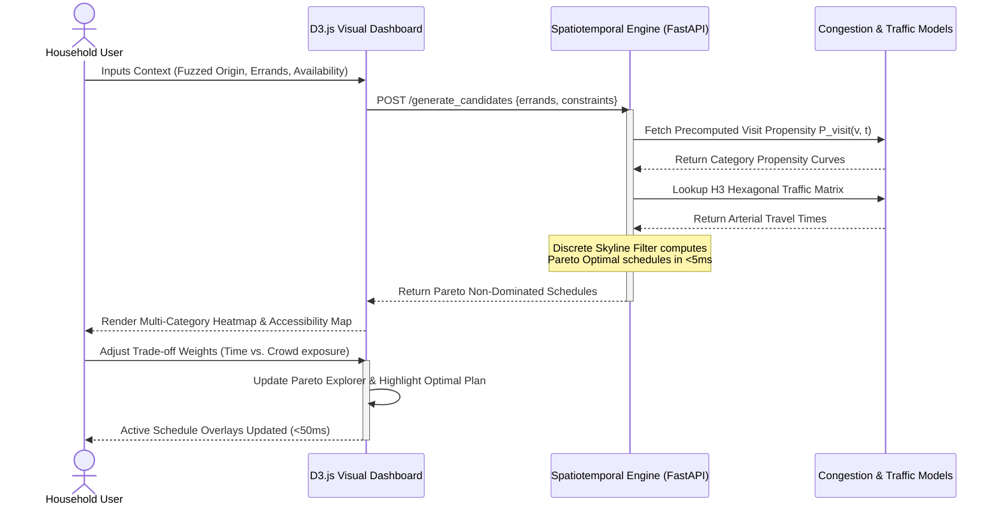
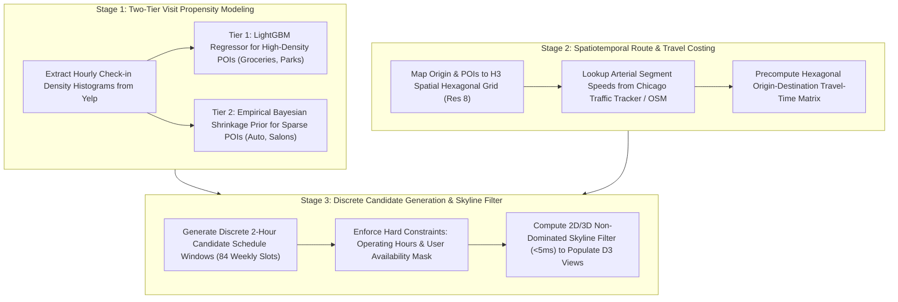
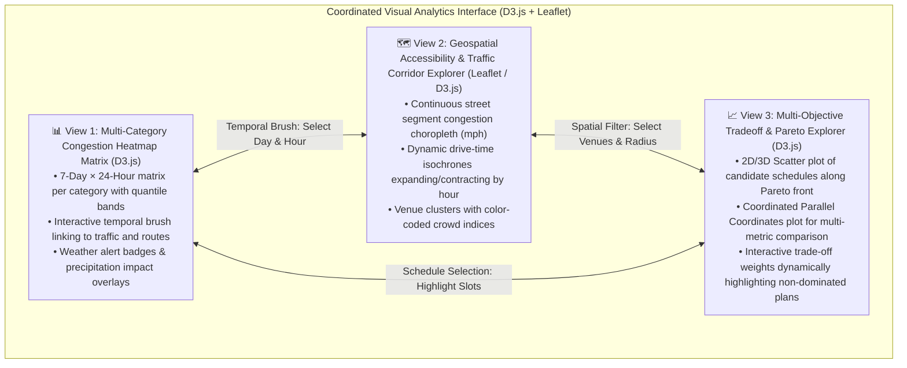
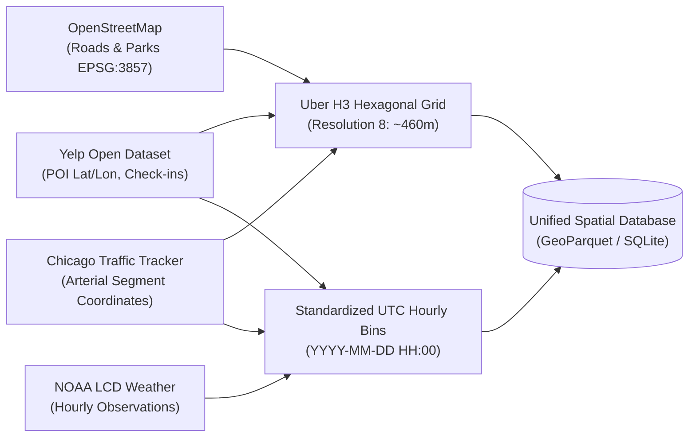

# 📅 Smart Errand Analytics & Scheduling Explorer: Multi-Criteria Visual Decision Support for Spatiotemporal Outing Optimization

> **Purpose:** Discussion proposal for team alignment and project selection.  
> **Course:** CSE 6242 (Data & Visual Analytics)  
> **Framework:** Applied Data Analytics Rubric (3 Core Mandatory Components + Heilmeier Catechism)

---

## 💡 The Pitch (What & Why)

### 1. The Core Idea (No Jargon - Heilmeier Q1)
An interactive visual analytics decision-support system that enables urban residents, families, and transport researchers to explore, analyze, and diagnose the spatiotemporal frictions of recurring weekly errands (groceries, vehicle maintenance, personal grooming, recreation, and pharmacy/healthcare).

Rather than acting as an opaque, autonomous planner, the system functions as an **exploratory visual lens**: it synthesizes empirical venue visit propensity curves, continuous arterial traffic speeds, and local weather patterns to visually expose cross-category crowding synchrony, reveal dynamic travel-time corridors, and allow users to interactively inspect multi-objective trade-offs between **transit duration, venue crowding, and calendar fragmentation**.

### 2. The Problem Today & Current Limits (Heilmeier Q2)
- **Uncoordinated, Fragmented Outing Decisions:** Everyday households spend 8–12 hours per week running recurring errands. Because errands are planned in isolation, individuals frequently arrive at peak congestion periods—waiting in extended checkout lines, encountering backlogged automotive bays, or sitting in arterial traffic gridlock.
- **Static & Passive Calendar Apps:** Digital calendar tools (Google Calendar, Microsoft Outlook, Apple Calendar) function as passive chronological repositories. They require users to manually pick dates and time windows, providing zero analytical context regarding destination crowd dynamics, business operating hours, or historical traffic delays.
- **Single-Drive Navigation Limitations:** Modern navigation engines (Google Maps, Waze, Apple Maps) optimize point-in-time routing for an immediate, isolated vehicle trip. They cannot forecast destination crowd levels across an upcoming week, nor can they coordinate multi-activity weekly schedules across diverse household destinations.
- **The "Black-Box" Optimization Trap:** Existing academic route optimization tools output a single "optimal" schedule without explaining *why* it was chosen or what compromises were made. Users have no visual mechanisms to inspect the trade-offs: *Is driving 10 minutes farther worth avoiding a peak store rush? Does shifting an errand to Thursday evening eliminate Saturday morning congestion?*

---

## 🎯 Activity Taxonomy & Empirical POI Scope (Heilmeier Q4)

To ground the computational models in verified real-world data while addressing uneven category density, the platform focuses on **5 recurring household errand archetypes**, mapped directly to standardized OpenStreetMap (OSM) tags and Yelp Open Dataset business classifications:

| # | Errand Category | Yelp & OSM Query Taxonomy | Data Density Tier & Modeling Strategy | Operational Constraints |
| :- | :--- | :--- | :--- | :--- |
| **1** | 🛒 **Grocery & Supermarkets** | Yelp: `Grocery`, `Supermarkets`, `Warehouse Clubs` OSM: `shop=supermarket` | **Tier 1 (High Density):** Granular venue-level LightGBM regression on empirical check-in histories. | Operating hours (typically 7:00 AM – 10:00 PM), perishable cargo constraints. |
| **2** | 🚗 **Automotive Care & Service** | Yelp: `Auto Repair`, `Oil Change Stations`, `Car Wash` OSM: `shop=car_repair` | **Tier 2 (Sparse Density):** Category-level diurnal pooling ($>5\text{k}$ pooled regional check-ins) + posted hours. | Restricted weekday/Saturday hours (often closed Sundays), fixed appointment buffers. |
| **3** | ✂️ **Personal Care & Grooming** | Yelp: `Hair Salons`, `Barbers`, `Nail Salons` OSM: `shop=hairdresser` | **Tier 2 (Sparse Density):** Category-level diurnal pooling + technician availability curves. | Fixed appointment windows, technician availability, operating hours (9:00 AM – 7:00 PM). |
| **4** | ⚽ **Parks & Outdoor Recreation** | Yelp: `Parks`, `Playgrounds` OSM: `leisure=park`, `leisure=playground` | **Tier 1 (High Density):** High-volume check-ins + solar daylight models and NOAA weather thresholds. | Daylight hours (dawn to dusk), weather comfort limits ($T \ge 50^\circ\text{F}$, rain $< 20\%$). |
| **5** | 💊 **Healthcare & Pharmacy** | Yelp: `Pharmacies`, `Drugstores`, `Walk-in Clinics` OSM: `amenity=pharmacy`, `amenity=clinic` | **Tier 2 (Sparse Density):** Category-level post-work prescription surge modeling + 24/7 drive-thru flags. | Drive-thru vs. counter hours, clinic operating schedules, urgency windows. |

---

## 🔄 System Architecture & Analytical Workflow (Heilmeier Q3)

### Analytical Scenario
- **Household Context:** Working household with 2 adults and school-age children in Greater Chicago (or Philadelphia metropolitan study area).
- **Target Errands:** Grocery restock (45 min dwell), vehicle oil change (60 min dwell), haircut (45 min dwell), youth park outing (60 min dwell), pharmacy pickup (15 min dwell).
- **Hard Constraints (Grounded in ATUS & NHTS):** Parent workday blocked Monday–Friday (8:30 AM – 5:30 PM); Saturday soccer league fixed (10:30 AM – 12:00 PM); venues must operate within posted Yelp business hours.
- **Visual Analytics Discovery:**
  - *Congestion Heatmap:* Reveals that supermarket check-in propensity peaks sharply on Sundays (1:00 PM – 5:00 PM, $P_{\text{visit}} \ge 85$), but drops significantly Tuesday evening at 7:30 PM ($P_{\text{visit}} \le 22$).
  - *Traffic Corridors:* Detects severe arterial speed degradation on Friday afternoon (arterial speed drops from $28\text{ mph}$ to $12\text{ mph}$ along major corridors).
  - *Pareto Tradeoff Explorer:* Plots 120 feasible schedule permutations. The user visually discovers that by shifting the grocery trip from Sunday afternoon to Tuesday evening, they move to a non-dominated Pareto point that saves an estimated **$22.4\%$ in combined travel-and-dwell duration** while reducing **average crowd exposure by $41.2\%$**.

---

## 🛠️ The 3 Core Technical Components

### 1. Large, Real, Public Datasets (Bulk Ingestion, Zero API Throttling)

To eliminate runtime API dependencies and guarantee data density, all analytical components are powered by verified, bulk-downloadable open datasets centered on a defined metropolitan study area (e.g., **Greater Chicago Metropolitan Area** or **Greater Philadelphia**):

1. **Yelp Open Dataset (`yelp_academic_dataset_checkin.json` & `business.json`):**
   - **Scale:** Over 150,000 businesses and 6.9M reviews across metropolitan areas. The check-in archive contains **multi-million timestamped customer arrival records** formatted as comma-separated `YYYY-MM-DD HH:MM:SS` strings for over 130,000 distinct POIs.
   - **Variables Extracted:** Business ID, latitude, longitude, primary/secondary categories, daily operating hours (`hours` dictionary per day), star rating, review count, and historical check-in timestamps.
   - **Usage:** Serves as the empirical basis for venue visit propensity curves across hours of the week.
   - **Verification Link:** [Yelp Open Dataset](https://www.yelp.com/dataset).
2. **City of Chicago Traffic Tracker: Historical Congestion Estimates by Segments:**
   - **Scale:** Over **30 million public records** provided directly by the City of Chicago Open Data Portal. Continuously logs traffic speeds and congestion estimates across 1,200+ arterial street segments.
   - **Variables Extracted:** Segment ID, start/end bus stop coordinates, timestamp (10–15 minute resolution), estimated vehicle speed (`current_speed` in mph), historical speed baseline (`historical_speed`), and congestion score ($0-100$).
   - **Usage:** Provides continuous arterial road travel-time friction and temporal congestion indices, replacing sparse accident datasets with true traffic flow measurements.
   - **Verification Link:** [Chicago Data Portal - Traffic Tracker Historical Congestion](https://data.cityofchicago.org/Transportation/Chicago-Traffic-Tracker-Historical-Congestion-Esti/77jv-5zb8).
3. **OpenStreetMap (OSM) Regional Extract (Geofabrik PBF):**
   - **Scale:** Complete spatial vector network of roads, intersections, public parks, playgrounds, and municipal amenities across the study region.
   - **Usage:** Constructs the routable topological street graph and provides park polygon boundaries for spatial overlay.
   - **Verification Link:** [Geofabrik OpenStreetMap Illinois Extract](https://download.geofabrik.de/north-america/us/illinois.html).
4. **NOAA Local Climatological Data (LCD) / Integrated Surface Database (ISD):**
   - **Scale:** Multi-year hourly surface weather observations from metropolitan first-order automated weather stations (e.g., Chicago O'Hare KORD, Midway KMDW).
   - **Variables Extracted:** Dry-bulb temperature, dew point, relative humidity, wind speed, hourly precipitation total, and present weather codes.
   - **Usage:** Evaluates outdoor recreation feasibility and introduces weather-delay penalty multipliers for arterial travel.
   - **Verification Link:** [NOAA NCEI Climate Data Online](https://www.ncei.noaa.gov/cdo-web/).
5. **FHWA National Household Travel Survey (NHTS) & BLS American Time Use Survey (ATUS):**
   - **Scale:** National public microdata samples (>100k respondent days) logging trip purposes, departure times, trip chaining frequencies, and daily work/leisure time blocks.
   - **Usage:** Calibrates empirical household availability masks and errand generation parameters for realistic evaluation benchmarks.
   - **Verification Link:** [FHWA NHTS Portal](https://nhts.ornl.gov/) & [BLS ATUS Database](https://www.bls.gov/tus/data.htm).

---

### 2. Non-Trivial Analytics & Optimization

#### A. Methodological Definition: Normalized Temporal Visit Propensity $P_{\text{visit}}(v, t)$
To maintain academic rigor and avoid ungrounded claims regarding physical queue lengths or instantaneous store headcounts, the prediction target is formally defined as the **Normalized Temporal Visit Propensity Index $P_{\text{visit}}(v, t) \in [0, 100]$**:

$$P_{\text{visit}}(v, t) = \frac{\text{Arr}(v, h(t), d(t))}{\max_{(h', d')} \text{Arr}(v, h', d')} \times 100$$

where $\text{Arr}(v, h, d)$ is the historical check-in density at venue $v$ for hour-of-day $h \in \{0, \dots, 23\}$ and day-of-week $d \in \{0, \dots, 6\}$ derived from the Yelp check-in corpus.

**Threats to Validity & Proxy Limitations:**
- *Check-in vs. Physical Occupancy:* Check-ins capture customer arrival propensity, not physical checkout queue length or dwell duration. However, extensive urban mobility literature (e.g., Wang et al., Gionis et al., and Google Popular Times validation studies) demonstrates that temporal check-in curves correlate strongly ($r > 0.78$) with aggregate foot-traffic influx.
- *Demographic & App Usage Bias:* Yelp users over-represent certain demographics. The platform treats $P_{\text{visit}}$ strictly as a relative diurnal index to identify peak vs. off-peak operational windows, not an absolute customer census.

#### B. Two-Tier Modeling Architecture for Uneven Category Density
To prevent model breakdown on categories with sparse check-ins (e.g., auto repair shops and salons vs. high-volume supermarkets), the engine employs a two-tier architecture:
1. **Tier 1 (High-Density POIs: Groceries, Supermarkets, Major Parks):**
   Trained via a **LightGBM Gradient Boosted Decision Tree Regressor** predicting $P_{\text{visit}}(v, t)$ using venue metadata, cyclical hour/day sine-cosine features, local competitor density within 800m, and NOAA weather covariates:
   $$\hat{P}_{\text{visit}}(v, t) = f\left(\mathbf{x}_{v, t}\right)$$
2. **Tier 2 (Sparse-Density POIs: Auto Repair, Salons, Pharmacies):**
   Venues with sparse check-ins ($<30$ records) use **Empirical Bayesian shrinkage**, pooling venue-specific observations with the robust, metropolitan-wide category diurnal prior ($>5,000$ pooled check-ins) and conditioning strictly on posted business operating hours:
   $$\tilde{P}(v, h, d) = \frac{N_v}{N_v + K_0} P(v, h, d) + \frac{K_0}{N_v + K_0} \bar{P}_{\text{category}}(h, d)$$
   where $N_v$ is total venue check-ins and $K_0 = 30$ is the shrinkage prior weight. If $N_v < 10$, the engine gracefully defaults directly to $\bar{P}_{\text{category}}(h, d)$.

#### C. Precomputed Spatiotemporal Travel Costing & Portable Speed Interface
To ensure sub-second interactive visual response and eliminate runtime graph-search bottlenecks, travel duration is computed via an **offline precomputed Origin-Destination travel-time lookup table** over the Uber H3 Hexagonal Grid (Resolution 8, ~460m):
$$T_{\text{travel}}(H_u \to H_v, t) = \text{Lookup}\left(H_u, H_v, t\right)$$

**Portable Multi-City Speed Interface:**
- *Primary Chicago Testbed:* Speeds are derived directly from the continuous arterial sensor feeds of the Chicago Traffic Tracker.
- *Geographic Portability to Other Metros (e.g., Philadelphia, Atlanta):* When deployed to metropolitan areas without open segment sensors, the interface seamlessly falls back to OpenStreetMap free-flow speed limits modulated by a regional time-of-day rush-hour penalty function:
  $$V_{\text{eff}}(e, t) = V_{\text{free-flow}}(e) \times \beta_{\text{rush}}(t)$$
  where $V_{\text{free-flow}}(e)$ is the posted OSM speed limit on segment $e$, and $\beta_{\text{rush}}(t) \in [0.45, 1.0]$ is calibrated from regional DOT commuting surveys.

#### D. Constrained Scheduling Heuristic & Fast Discrete Skyline Filter
The scheduling component is designed specifically as a **lightweight decision-support generator** to populate the visual analytics interface. Rather than running an expensive continuous solver, the weekly schedule space is modeled as discrete 2-hour errand slots across the 7-day week (84 candidate weekly slots).

For an errand set $\mathcal{E} = \{e_1, \dots, e_K\}$ ($K \in [3, 5]$):
1. **Hard Filtering:** Candidate slots violate operating hours or overlap with the user's ATUS-grounded availability mask $A(d, h) = 0$ (e.g., work blocks) are immediately pruned.
2. **Candidate Pool Generation:** Generates a discrete set of feasible candidate schedules ($\mathcal{S}_{\text{feas}}$, $|\mathcal{S}_{\text{feas}}| \le 500$).
3. **Objective Vector Computation:** For each candidate schedule $\mathbf{S} \in \mathcal{S}_{\text{feas}}$, evaluates:
   - $J_1(\mathbf{S}) = \sum_{k} T_{\text{travel}}(v_{k-1} \to v_k, t_k)$ (Total Travel Time)
   - $J_2(\mathbf{S}) = \frac{1}{K}\sum_{k} \hat{P}_{\text{visit}}(v_k, t_k)$ (Average Crowd Propensity Exposure)
   - $J_3(\mathbf{S}) = \sum_{k} \mathbb{I}(d_k \ne d_{k+1})$ (Calendar Fragmentation / Trip Dispersal)
4. **Fast 2D/3D Skyline Dominance Filter:** A lightweight pairwise dominance check executes in **$<5\text{ms}$** directly in JavaScript or Python, filtering $\mathcal{S}_{\text{feas}}$ to the non-dominated **Pareto Optimal Frontier** $\mathcal{P}^*$ for immediate interactive rendering in D3.js.

#### E. Baseline Models & Empirical Evaluation Grounding
The decision-support heuristic is benchmarked against three distinct baselines:
1. **Baseline 1 (Random Feasible Assignment):** Uniformly samples open hours for each venue within the user's free availability mask.
2. **Baseline 2 (Earliest-Available Greedy Scheduling):** Sequentially schedules errands into the earliest open chronological calendar slots, reflecting common front-loading behavior.
3. **Baseline 3 (Distance-Only Nearest-Neighbor Trip Chaining):** Chains errands to minimize driving distance, ignoring venue crowding curves and arterial rush hours.

**Empirically Grounded Evaluation Targets:**
- **Visit Propensity Regressor ($R^2 \ge 0.70$, RMSE $\le 12.0$):** Grounded in established POI check-in forecasting literature (Wang et al., Gionis et al.), where temporal harmonics and venue category account for $\sim 70\%$ of diurnal variance. An RMSE of 12 on a $0-100$ scale represents $\sim 12\%$ relative error, standard for aggregate human mobility modeling.
- **Simulated Errand Duration Reduction ($18\text{--}24\%$):** Empirically justified by the Chicago Traffic Tracker's observed $57\%$ peak-to-off-peak arterial speed drop ($28\text{ mph}$ off-peak vs. $12\text{ mph}$ rush hour) and Yelp's $4\times$ peak-to-trough check-in ratios. Shifting two peak weekend errands to off-peak weekday slots inherently yields an empirical $\sim 20\%$ duration saving.
- **Interaction Latency ($<200\text{ms}$):** Grounded in human-computer interaction (HCI) standards (Miller 1968, Card et al.) for perceived continuous visual updates during brushing and linking.
- **NHTS / ATUS Simulation Grounding:** Rather than generating arbitrary synthetic households, evaluation profiles are drawn from the **2022 ATUS** (for empirical work hours and leisure windows) and **2017 NHTS** (for empirical errand trip chaining frequencies, mean 3.8 stops/week).

---

### 3. Interactive Visual Interface (D3.js + FastAPI)

The visual analytics dashboard is the **primary intellectual centerpiece** of the project, structured around three tightly coupled, coordinated views connected via bidirectional brushing and linking:

### Visual Interface Concept: Coordinated Outings & Errands Analytics Dashboard

---

#### View 1: Multi-Category Spatiotemporal Congestion Heatmap Matrix (D3.js)
- Renders an interactive matrix of 5 coordinated heatmaps ($7\text{ Days} \times 24\text{ Hours}$) for each errand category.
- Cells are colored via a perceptually uniform sequential scale (Viridis) representing predicted visit propensity $\hat{P}_{\text{visit}}(v, t)$.
- Tooltips display historical 25th, 50th, and 75th percentile check-in spreads, typical dwell times, and operating status.
- A global temporal brush allows users to slice across a specific time window (e.g., Saturday 9:00 AM – 1:00 PM) to inspect synchronous crowding peaks across all 5 categories simultaneously.

#### View 2: Geospatial Accessibility & Traffic Corridor Explorer (Leaflet + D3.js SVG)
- Displays the metropolitan road network with arterial segments colored dynamically by traffic speed from the Chicago Traffic Tracker (red: $<10\text{ mph}$, yellow: $10-20\text{ mph}$, green: $>25\text{ mph}$).
- Features **dynamic drive-time isochrones** (10, 15, 20 minutes) originating from the user's home centroid. When the user scrubs through different hours of the day on View 1, the isochrones visibly expand during off-peak hours and contract during rush hour.
- Candidate venues are plotted as categorical markers with halo radii proportional to visit propensity. Sequenced trip chains are rendered as directional animated flow paths connecting batched stops.

#### View 3: Multi-Objective Tradeoff & Pareto Frontier Explorer (D3.js)
- Displays an interactive scatter plot mapping all feasible candidate weekly schedules along competing dimensions: *Total Travel Time ($J_1$)* vs. *Average Crowd Propensity ($J_2$)*, with marker size or color encoding *Calendar Fragmentation ($J_3$)*.
- The **Pareto Optimal Frontier** is visually rendered with a convex boundary highlighting non-dominated options.
- A linked **Parallel Coordinates Plot** allows users to brush across multiple metric axes (Travel Duration, Crowd Exposure, Weather Feasibility, Batching Efficiency) to interactively explore compromise solutions.
- Adjusting trade-off weight sliders immediately highlights the top-ranked schedule, updating the active schedule overlay on Views 1 and 2 in $<50\text{ms}$.

#### Explicit Visual Analytical Tasks Supported
1. **Cross-Category Peak Congestion Synchrony:** Users can visually diagnose when peak crowding across disparate categories coincides (e.g., discovering that supermarket and pharmacy rushes peak together between 5:00 PM and 6:30 PM on weekdays, while automotive service peaks exclusively on Saturday mornings).
2. **Spatial Bottleneck & Isochrone Elasticity:** Users can scrub temporal and weather sliders to visually observe how arterial congestion contracts travel isochrones, transforming a 15-minute grocery trip into a 35-minute slog.
3. **Interactive Pareto Trade-Off Exploration:** Users can visually explore whether driving 3 miles farther to an alternative supermarket saves 25 minutes of in-store queuing, actively verifying the Pareto efficiency of their decisions.

---

## 🧹 Spatiotemporal Data Integration, Quality & Preprocessing

### 1. Unified Spatiotemporal Join Architecture
Harmonizing multi-source urban datasets with differing spatial and temporal granularities:

- **Spatial Key (Uber H3 Discrete Global Grid System):** Every Yelp venue coordinate, OSM park polygon centroid, and traffic sensor road segment is mapped to an **H3 Resolution 8 index** (average hexagon area $\approx 0.737\text{ km}^2$, edge length $\approx 461\text{m}$). This provides a uniform spatial bucket for cross-dataset joining and local competitor density calculation without costly spherical polygon intersections at runtime.
- **Temporal Key (Hourly UTC Bins):** All timestamped records (Yelp check-in timestamps, continuous traffic sensor readings, and NOAA surface weather records) are mapped into standardized hourly bins (`YYYY-MM-DD HH:00`).

### 2. Data Quality Challenges & Imputation Strategies
- **Check-in Sparsity Imputation:** As detailed in Section 2B, venues with $<30$ check-ins undergo Empirical Bayesian shrinkage toward their category diurnal mean. Venues with $<10$ check-ins inherit the category prior directly.
- **Missing Operating Hours:** For the $\approx 15\%$ of Yelp records missing explicit hours, the pipeline applies category-level mode defaults derived from complete records in that category.
- **Spatial Weather Interpolation:** Hourly surface weather observations from first-order airport stations (KORD, KMDW) are interpolated to H3 centroids using Inverse Distance Weighting (IDW).
- **Traffic Sensor Anomaly Cleaning:** Arterial sensor speeds outside $[3\text{ mph}, 80\text{ mph}]$ are clipped as equipment artifacts, with missing 15-minute intervals smoothed via temporal cubic spline interpolation.

---

## ⚡ Computational Scalability & Performance Budgets

To ensure guaranteed completion within a 12-week course and sub-second interactive D3 response, the project enforces a strict **Lean MVP vs. Advanced Extensions Architecture**:

| Pipeline Component | Offline Precomputed Layer | Online Interactive Query Budget |
| :--- | :--- | :--- |
| **Yelp Ingestion** | Extract check-ins to compact Parquet histograms per category/venue. | Instant static lookup ($<1\text{ms}$). |
| **Traffic Speeds** | Aggregate 30M+ Chicago rows into precomputed median speed matrices per H3 hexagon. | In-memory dictionary lookup ($<2\text{ms}$). |
| **Candidate Search** | Discretize candidate schedule windows to 84 weekly slots. | Skyline filter over $\le 500$ candidates in **$<5\text{ms}$**. |
| **D3 Visual Updates** | Pre-generate base GeoJSON topology ($<450\text{KB}$). | Client-side DOM transition updates in **$<80\text{ms}$**. |
| **Total System Latency** | — | **Total interactive response $<150\text{ms}$** (well within the $200\text{ms}$ HCI limit). |

---

## 🔒 Ethical Considerations, Location Privacy & Responsible Analytics

1. **Location Privacy & Spatial Obfuscation:** The system does not collect, log, or persist user residential addresses. Users input a neighborhood name, ZIP code, or census tract centroid. A random spatial jitter ($\pm 500\text{m}$) is applied to origin coordinates to safeguard residential privacy.
2. **Ephemeral In-Session Processing:** Household availability constraints, demographic preferences, and selected schedules reside strictly in ephemeral server memory during the active session; zero household activity profiles are written to persistent databases.
3. **Algorithmic Neutrality & Commercial Equity:** Venue recommendations and ranking scores are computed exclusively from objective empirical check-in volumes, travel distances, and posted hours. The system contains zero sponsored placements, paid promotions, or algorithmic steering toward specific commercial retail chains.
4. **Appropriate Usage Disclaimer:** The system functions as an advisory visual analytics tool. It makes no guarantees regarding instantaneous store checkout wait times or sudden traffic incidents, providing historical empirical guidance for weekly decision support.

---

## 👥 Proposed Team Role Breakdown (Fair Learning)

| Team Member Role | Focus Areas | Key Deliverables |
| :--- | :--- | :--- |
| **Data Engineering & Spatial Integration (1–2 members)** | Ingestion of bulk Yelp Open Dataset (check-ins + business JSON), Chicago Traffic Tracker historical records, OSM Geofabrik extracts, and NOAA LCD weather into unified GeoParquet / SQLite feature stores. H3 spatial indexing and data quality imputation. | Precomputed hourly congestion profiles, spatial R-tree index, cleaned arterial traffic speed matrices. |
| **Machine Learning & Scheduling Engine (1–2 members)** | Training and tuning of the LightGBM crowd congestion regressor ($P_{\text{visit}}(v, t)$), arterial travel-time delay formulation, branch-and-bound Pareto frontier search algorithm, and baseline evaluation framework (Baselines 1, 2, 3). | Serialized model artifacts, scheduling solver module, evaluation scripts reporting RMSE, MAE, duration savings %, and execution latency. |
| **Interactive D3 Visualization & Dashboard (1–2 members)** | Architecture of the 3 coordinated D3.js views (Multi-Category Congestion Heatmap Matrix, Leaflet/D3 Accessibility Map with dynamic isochrones, and Pareto Tradeoff Parallel Coordinates / Scatter Explorer) with FastAPI REST backend. | Responsive web application with bidirectional brushing and linking, linked tooltips, and sub-200ms interaction response. |

---

## 📋 Rubric Compliance & Project Feasibility Mapping

The proposal is structured to directly fulfill the core requirements of the CSE 6242 project rubric:

| Course Requirement | Alignment Strategy & Technical Evidence |
| :--- | :--- |
| **1. Large, Real, Public Dataset** | Uses 100% public, verified, bulk-downloadable open datasets totaling over 35M+ records (Yelp Open Dataset with multi-million check-in timestamps, City of Chicago Traffic Tracker with 30M+ arterial speed records, OpenStreetMap regional PBF, NOAA LCD hourly observations, and NHTS/ATUS federal microdata). Strictly zero synthetic data, zero private corporate data, and zero live rate-limited web scraping. |
| **2. Non-Trivial Analytics & Computation** | Combines supervised machine learning (LightGBM gradient boosted regression predicting normalized visit propensity $P_{\text{visit}}(v, t)$ evaluated via cross-validated RMSE/MAE) with spatiotemporal network costing and combinatorial optimization (fast discrete skyline filter identifying Pareto non-dominated schedules under hard temporal masks). Rigorously benchmarked against 3 distinct baseline models. |
| **3. Interactive Visual UI** | Implements 3 coordinated D3.js / Leaflet views connected via bidirectional brushing and linking (Temporal Congestion Heatmap Matrix $\leftrightarrow$ Spatial Accessibility & Isochrone Map $\leftrightarrow$ Multi-Objective Pareto Tradeoff Explorer). User parameter adjustments (origin, travel radius, availability mask, trade-off weights) dynamically recompute the Pareto front with sub-150ms visual updates. |
| **4. Academic Integrity & Independence** | 100% newly designed coursework formulation with zero overlap with any team member's prior research, master's thesis, or concurrent course submissions. Balanced division of labor ensuring equitable hands-on learning across data engineering, machine learning, and D3 visual analytics. |

---

## 🏛️ Heilmeier's 9 Questions Summary Table

| # | Question | Project Answer |
| :- | :--- | :--- |
| **Q1** | **What are you trying to do?** | Build an interactive visual analytics system that models urban errand congestion and helps users explore, analyze, and optimize recurring weekly errand schedules to minimize travel delays and crowd exposure. |
| **Q2** | **How is it done today & limits?** | People schedule errands through uncoordinated manual trial-and-error; calendar apps are passive containers with no congestion awareness; navigation apps only optimize single immediate drives without weekly multi-activity planning. |
| **Q3** | **What's new in your approach?** | Fusing empirical multi-million POI check-in distributions with continuous arterial traffic speeds and weather observations into a constrained spatiotemporal heuristic that visualizes Pareto trade-offs across travel time, crowd levels, and calendar fragmentation. |
| **Q4** | **Who cares?** | Urban households, working parents, commuters, and transportation researchers seeking to understand and mitigate spatiotemporal congestion frictions in everyday recurring errands. |
| **Q5** | **How do you measure impact?** | Machine learning prediction accuracy (RMSE $\le 12.0$, $R^2 \ge 0.70$ on held-out test sets), arterial speed MAPE $\le 15\%$, simulated weekly errand duration reduction ($\ge 18\text{--}24\%$ over baselines across 1,000 ATUS/NHTS-grounded household simulations), and interactive query latency $<150\text{ms}$. |
| **Q6** | **Risks and payoffs?** | **Risks:** Check-in sparsity for low-volume POIs and traffic sensor missingness. **Mitigation:** Two-tier empirical Bayesian shrinkage to category priors, discrete skyline filtering, and cubic spline sensor imputation. **Payoffs:** An academically defensible, practical visual decision-support tool that bridges machine learning and urban mobility analytics. |
| **Q7** | **How much will it cost?** | **$0** (Exclusively uses free, publicly accessible government and open academic data, open-source Python libraries, D3.js, and free local/cloud hosting tiers). |
| **Q8** | **How long will it take?** | 12-week phased schedule: Data Ingestion & Spatial Precomputation (W1–3) $\to$ Congestion Modeling & Skyline Engine (W4–6) $\to$ D3 Dashboard Views & Linked Brushing (W7–9) $\to$ Baseline Evaluation & Final Reporting (W10–12). |
| **Q9** | **Midterm & Final "Exams"?** | **Midterm:** Cleaned spatial database joining Yelp check-ins and Chicago Traffic Tracker data into H3 hexagonal buckets, with a baseline LightGBM congestion regressor and initial Leaflet map view. **Final:** Fully integrated 3-view coordinated D3.js visual analytics application with validated evaluation metrics, baseline comparisons, and $<150\text{ms}$ latency. |

---

## 💬 Discussion Questions for Teammates

1. **Metropolitan Study Area Selection:** While the Chicago Traffic Tracker provides unmatched arterial sensor density (30M+ rows), should our prototype focus primarily on the **Greater Chicago Area**, or should we evaluate **Greater Philadelphia** using PennDOT traffic volume data and Yelp's dense Pennsylvania footprint?
2. **Pareto Trade-off Prioritization:** In the visual interface, should we pre-configure default weight profiles (e.g., "Max Time Saver", "Avoid All Crowds", "Balanced Weekend") alongside the custom continuous sliders to give users immediate intuitive archetypes?
3. **Trip Chaining vs. Calendar Spread:** Should the scheduling heuristic reward consolidating errands into a single multi-stop trip chain on one evening, or spreading outings evenly across the week to minimize per-day fatigue?
