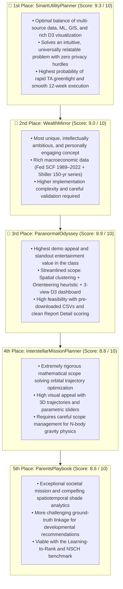
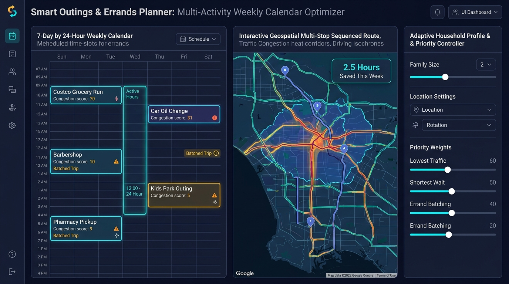
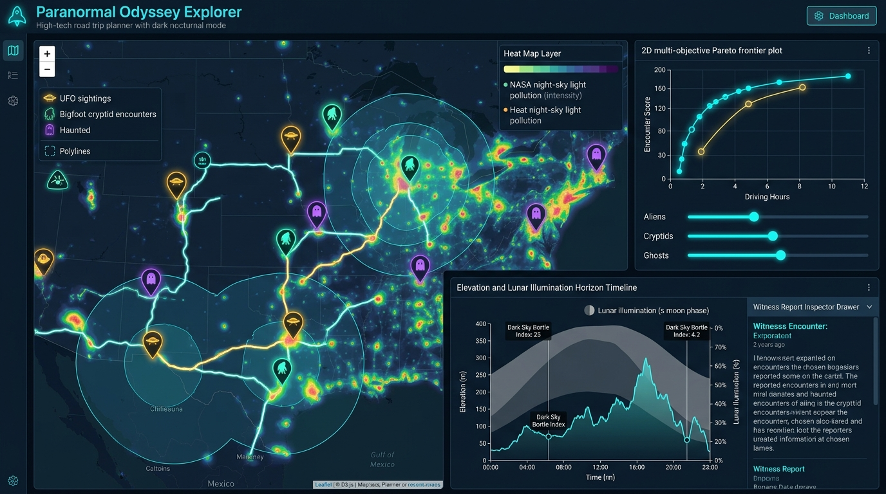

# ⚖️ CSE 6242 Project Topic Comparison & Decision Matrix

> **Purpose:** Comprehensive comparative analysis of the proposed CSE 6242 topics to guide team alignment, risk assessment, and final project selection.  
> **Course:** CSE 6242 (Data & Visual Analytics)

---

## 📊 Comprehensive Side-by-Side Evaluation

| Evaluation Criteria | 📅 [SmartUtilityPlanner](file:///Users/tejashriachari/Documents/Gatech/CSE_6242/cse6242/projectwork/topics/SmartUtilityPlanner.md) | 🪙 [WealthMirror](file:///Users/tejashriachari/Documents/Gatech/CSE_6242/cse6242/projectwork/topics/WealthMirror.md) | 🛸 [ParanormalOdyssey](file:///Users/tejashriachari/Documents/Gatech/CSE_6242/cse6242/projectwork/topics/ParanormalTravelPlanner.md) | 🪐 [InterstellarMissionPlanner](file:///Users/tejashriachari/Documents/Gatech/CSE_6242/cse6242/projectwork/topics/InterstellarMissionPlanner.md) | 🍼 [ParentsPlaybook](file:///Users/tejashriachari/Documents/Gatech/CSE_6242/cse6242/projectwork/topics/ParentsPlaybook.md) |
| :--- | :--- | :--- | :--- | :--- | :--- |
| **Primary Domain** | Urban Mobility & Errand Analytics | Personal Finance & Wealth Analytics | Cultural Tourism & Spatiotemporal Itinerary Optimization | Aerospace Engineering & Orbital Optimization | Early Childhood Development & Accessibility |
| **Dataset Strength** | ⭐⭐⭐⭐⭐ | ⭐⭐⭐⭐⭐ | ⭐⭐⭐⭐⭐ | ⭐⭐⭐⭐ | ⭐⭐⭐⭐ |
| **ML / Analytics Depth** | High | Very High | High (Spatial Clustering + Routing Heuristic) | Very High (Physics Simulation & Genetic Algorithms) | High |
| **Visualization Strength** | ⭐⭐⭐⭐⭐ | ⭐⭐⭐⭐⭐ | ⭐⭐⭐⭐⭐ (Streamlined 3-View Dashboard) | ⭐⭐⭐⭐⭐ (3D Trajectory & Porkchop plots) | ⭐⭐⭐⭐ |
| **Geospatial Analytics** | ⭐⭐⭐⭐⭐ | ⭐⭐ | ⭐⭐⭐⭐⭐ | ⭐⭐⭐ (Astrometric, not terrestrial) | ⭐⭐⭐⭐⭐ |
| **Novelty** | High | Very High | ⭐⭐⭐⭐⭐ (Extreme) | ⭐⭐⭐⭐⭐ | High |
| **Real-World Impact** | High | High | Moderate (Cultural Tourism & Folklore Analytics) | Moderate (Educational/Simulation) | Very High |
| **Ease of Explaining** | High | Medium | Very High | Medium-High | High |
| **Implementation Risk** | Medium | High | Low (Focused Scope: 3 Views + Offline CSVs) | High (Orbital math complexity) | Medium-High |
| **Validation Difficulty** | Medium | Medium-High | Low-Medium (Baseline Route Scoring) | High (Requires aerospace ground truth) | High |
| **Visual Analytics Focus** | Excellent | Excellent | Excellent (Coordinated Map, Tradeoffs, Schedule) | Excellent (Parametric sliders + 3D) | Good–Very Good |
| **Feasibility (12 Weeks)**| High | Medium | High (Streamlined & Derisked) | Medium | Medium |
| **Rubric Alignment** | ⭐⭐⭐⭐⭐ | ⭐⭐⭐⭐⭐ | ⭐⭐⭐⭐⭐ | ⭐⭐⭐⭐⭐ | ⭐⭐⭐⭐ |
| **Demo Appeal** | ⭐⭐⭐⭐⭐ | ⭐⭐⭐⭐⭐ | ⭐⭐⭐⭐⭐+ (Showstopper) | ⭐⭐⭐⭐⭐ | ⭐⭐⭐⭐ |
| **Academic Defensibility**| ⭐⭐⭐⭐⭐ | ⭐⭐⭐⭐ | ⭐⭐⭐⭐⭐ (Clean Academic Framing) | ⭐⭐⭐⭐⭐ | ⭐⭐⭐⭐ |
| **Biggest Strength** | Best balance of data, analytics, visualization, and feasibility | Most unique and intellectually ambitious | Unbeatable demo engagement, disciplined scope, and clear routing trade-offs | Solves complex combinatorial trajectory optimization with high demo appeal | Strongest societal impact and practical relevance |
| **Biggest Weakness** | Congestion is inferred from proxy signals | Very complex modeling and validation | Crowdsourced records require coordinate validation and population normalization | High mathematical complexity for web-based UI latency | Weakest ground-truth linkage |
| **Overall Score** | **`9.3 / 10`** | **`9.0 / 10`** | **`8.9 / 10`** | **`8.8 / 10`** | **`8.6 / 10`** |
| **Approval Probability** | **Highest** | **High** | **High (Derisked & TA-Aligned)** | **High** | **Moderate-High** |
| **Final Recommendation**| 🥇 **#1 Pick (Safest & Balanced)** | 🥈 **#2 Pick (Most Intellectual)** | 🥉 **#3 Pick (Most Entertaining & Feasible)** | **4th Pick (Strong aerospace alternative)** | 5th Pick (High Societal Value) |

---

## ⚠️ Top Drawbacks & Reviewer Stress Tests

### 1. 📅 [SmartUtilityPlanner](file:///Users/tejashriachari/Documents/Gatech/CSE_6242/cse6242/projectwork/topics/SmartUtilityPlanner.md)

| # | Critical Drawback / Vulnerability | Mitigation Strategy |
| :-: | :--- | :--- |
| **1** | **Proxy Congestion Signals:** Yelp check-in timestamps are only a proxy for venue visit propensity, not direct queue lengths or actual wait times. | Fusing continuous arterial traffic speeds from the City of Chicago Traffic Tracker with Yelp check-in density curves to create a composite friction index. |
| **2** | **Category Data Sparsity:** Secondary categories (auto repair, salons, pharmacies) have lower check-in frequency than supermarkets, requiring category-level pooling. | Implementing a two-tier modeling structure: granular LightGBM regression for dense categories, and pooled diurnal historical distributions for sparse ones. |
| **3** | **Engineering Breadth:** Fusing ML regression, arterial traffic modeling, spatial GIS, fast skyline filtering, and coordinated D3.js views is technically broad. | Using precomputed hexagonal spatial matrices and discrete skyline heuristics to keep interactive runtime latency $<5\text{ms}$. |

> **Critical Reviewer Question:** *"Why should Yelp check-in timestamps represent real congestion or wait times?"*

---

### 2. 🪙 [WealthMirror](file:///Users/tejashriachari/Documents/Gatech/CSE_6242/cse6242/projectwork/topics/WealthMirror.md)

| # | Critical Drawback / Vulnerability | Mitigation Strategy |
| :-: | :--- | :--- |
| **1** | **High Technical & Schema Complexity:** Ingestion, harmonization, and survey weighting across 30+ years of Federal Reserve SCF microdata requires significant data wrangling. | Establishing a standardized demographic feature schema and freezing cleaned Parquet tables early (Weeks 1–3) with official `WGT6529` survey weights. |
| **2** | **Multi-Decade Projection Validation:** Long-term 30-year wealth trajectories cannot be validated against individual futures during a single semester. | Reframing models from deterministic forecasts to empirical percentile corridors ($P_{10}–P_{90}$) and validating 5-year transitions using cross-validated quantile regression. |
| **3** | **Risk of Fintech App Drift:** High risk of drifting toward a personal finance calculator or robo-advisor rather than an exploratory visual analytics tool. | Emphasizing exploratory macroeconomic regime discovery (e.g., 1970s stagflation vs. 2008 GFC shock testing), cohort divergence, and Pareto trade-off frontiers. |

> **Critical Reviewer Question:** *"How do you validate a 30-year wealth forecast without ground-truth future outcomes?"*

---

### 3. 🛸 [ParanormalOdyssey](file:///Users/tejashriachari/Documents/Gatech/CSE_6242/cse6242/projectwork/topics/ParanormalTravelPlanner.md)

| # | Critical Drawback / Vulnerability | Mitigation Strategy |
| :-: | :--- | :--- |
| **1** | **The "Silly Project" TA Skepticism:** Evaluators may perceive studying UFO or Bigfoot sightings as scientifically frivolous or unserious. | Formulate the academic contribution strictly around **spatial hotspot clustering (DBSCAN/KDE)** and selective itinerary optimization on real-world crowdsourced archives. |
| **2** | **"Algorithm Showcasing" vs. User Insight:** Reviewers may worry the team is stacking algorithms (NLP, GAs, rasters) without a clear decision problem. | Streamlined scope to 3 clear pillars: Spatial clustering, Orienteering heuristic (Greedy + 2-Opt), and 3 coordinated D3 views (Map, Tradeoffs, Itinerary) focusing on driving vs. density trade-offs. |
| **3** | **Noisy Data & Absence of Supernatural Ground Truth:** Raw records have noisy coordinates, duplicate viral reports, and unverified accounts. | Preprocessing filters coordinate bounds, aggregates duplicate dates, normalizes by U.S. Census population density, and evaluates stops by a factual **Report Detail Score** (field completeness, not truthfulness). |

> **Critical Reviewer Question:** *"Isn't this just a fun novelty map? What makes the underlying computation non-trivial for graduate-level analytics?"*

---

### 4. 🪐 [InterstellarMissionPlanner](file:///Users/tejashriachari/Documents/Gatech/CSE_6242/cse6242/projectwork/topics/InterstellarMissionPlanner.md)

| # | Critical Drawback / Vulnerability | Mitigation Strategy |
| :-: | :--- | :--- |
| **1** | **Mathematical & Physics Complexity:** Solving multi-body N-body problems or Lambert's problem for gravity assists dynamically in the browser is computationally intense. | Limit the scope to 2D/3D simplified patched-conic approximations or pre-compute a massive heuristic grid for the sliders to query. |
| **2** | **Dataset Size Compliance:** The core exoplanet dataset is only ~5,500 rows, which risks failing the "Large Data" requirement. | Augmenting the static catalog with gigabytes of raw Kepler/TESS time-series light curve data or high-resolution NASA JPL Horizons ephemerides. |
| **3** | **Validation Challenges:** Validating optimal orbital paths requires a ground-truth aerospace engine (like STK or GMAT) which the team may not have access to. | Validate against known historical satellite trajectories (e.g., Voyager 2 or Cassini slingshots) before applying the model to fictional exoplanets. |

> **Critical Reviewer Question:** *"How are you ensuring your gravitational slingshot algorithms are mathematically rigorous and not just producing arbitrary visual curves?"*

---

### 5. 🍼 [ParentsPlaybook (ToddlerSprout)](file:///Users/tejashriachari/Documents/Gatech/CSE_6242/cse6242/projectwork/topics/ParentsPlaybook.md)

| # | Critical Drawback / Vulnerability | Mitigation Strategy |
| :-: | :--- | :--- |
| **1** | **Indirect Ground-Truth Linkage:** No direct dataset logs whether a 15-month-old specifically benefited developmentally from visiting Park A over Library B. | Calibrating recommendation rankings against empirical activity frequencies from the 50,000+ record CDC National Survey of Children's Health (NSCH). |
| **2** | **Developmental Quality Evaluation:** Quantifying "developmental suitability" relies on latent semantic embeddings linking CDC milestones to venue amenities. | Constructing an offline benchmark testbed of 500 validated scenarios and evaluating with NDCG@K, MRR, and paired Wilcoxon significance tests. |
| **3** | **Risk of Scheduler App Perception:** TAs may perceive the project as a simple family calendar or routine scheduler rather than a visual analytics platform. | Elevating urban spatial equity analysis (bivariate toddler density vs. park shade deserts), diurnal biometeorological stress matrices, and parallel coordinates. |

> **Critical Reviewer Question:** *"Where is the empirical ground truth showing that Activity A is developmentally superior to Activity B for a given child?"*

---

## 🏆 Final Ranking & Decision Architecture

1. 🥇 **[SmartUtilityPlanner](file:///Users/tejashriachari/Documents/Gatech/CSE_6242/cse6242/projectwork/topics/SmartUtilityPlanner.md) — Score: 9.3 / 10 (Highest Approval Probability)**  
   *Best overall balance of data density, predictive ML, spatiotemporal analytics, coordinated D3 visualization, and 12-week semester feasibility.*
2. 🥈 **[WealthMirror](file:///Users/tejashriachari/Documents/Gatech/CSE_6242/cse6242/projectwork/topics/WealthMirror.md) — Score: 9.0 / 10 (High Approval Probability)**  
   *Most innovative and intellectually ambitious topic; strongly defensible with Federal Reserve SCF microdata and zero synthetic data, though with higher modeling complexity.*
3. 🥉 **[ParanormalOdyssey](file:///Users/tejashriachari/Documents/Gatech/CSE_6242/cse6242/projectwork/topics/ParanormalTravelPlanner.md) — Score: 8.9 / 10 (Highest Demo Appeal / Most Feasible)**  
   *The crowd-pleasing showstopper. Streamlined to 3 core pillars (Spatial clustering, selective route optimization heuristic, and 3 coordinated views) with offline bulk CSVs and objective Report Detail scoring.*
4. 🪐 **[InterstellarMissionPlanner](file:///Users/tejashriachari/Documents/Gatech/CSE_6242/cse6242/projectwork/topics/InterstellarMissionPlanner.md) — Score: 8.8 / 10 (High Approval Probability)**  
   *An excellent aerospace alternative solving complex multi-body orbital trajectory optimization. High demo appeal but requires careful management of physics math complexity.*
5. 🍼 **[ParentsPlaybook (ToddlerSprout)](file:///Users/tejashriachari/Documents/Gatech/CSE_6242/cse6242/projectwork/topics/ParentsPlaybook.md) — Score: 8.6 / 10 (Moderate-High Approval Probability)**  
   *Highest societal and human impact; greatly strengthened by the CDC NSCH empirical ranking framework and tree canopy equity analytics.*

---

## 📚 Respective Topic Resources & Core Artifacts

### 1. 📅 [SmartUtilityPlanner](file:///Users/tejashriachari/Documents/Gatech/CSE_6242/cse6242/projectwork/topics/SmartUtilityPlanner.md)
- **Primary Proposal:** [SmartUtilityPlanner.md](file:///Users/tejashriachari/Documents/Gatech/CSE_6242/cse6242/projectwork/topics/SmartUtilityPlanner.md)
- **Verified Public Datasets:**
  - [Yelp Open Dataset](https://www.yelp.com/dataset) — 6.9M reviews, 150k businesses, multi-million check-in timestamps.
  - [City of Chicago Traffic Tracker](https://data.cityofchicago.org/Transportation/Chicago-Traffic-Tracker-Historical-Congestion-Esti/77jv-5zb8) — 30M+ historical congestion records across 1,200+ street segments.
  - [OpenStreetMap Illinois Extract (Geofabrik)](https://download.geofabrik.de/north-america/us/illinois.html) — Routable topological street graph and POI polygons.
  - [NOAA Local Climatological Data (LCD)](https://www.ncei.noaa.gov/cdo-web/) — Hourly automated surface weather observations (KORD, KMDW).
  - [FHWA NHTS Portal](https://nhts.ornl.gov/) & [BLS ATUS Database](https://www.bls.gov/tus/data.htm) — Household trip purpose and time-use microdata.
- **Visual Interface Concept:**
  

---

### 2. 🪙 [WealthMirror](file:///Users/tejashriachari/Documents/Gatech/CSE_6242/cse6242/projectwork/topics/WealthMirror.md)
- **Primary Proposal:** [WealthMirror.md](file:///Users/tejashriachari/Documents/Gatech/CSE_6242/cse6242/projectwork/topics/WealthMirror.md)
- **Verified Public Datasets:**
  - [Federal Reserve Survey of Consumer Finances (SCF)](https://www.federalreserve.gov/econres/scfindex.htm) — 1989–2022 triennial microdata, 30,000+ interviews, population weights (`WGT6529`).
  - [BLS Consumer Expenditure Surveys (CEX PUMD)](https://www.bls.gov/cex/pumd_data.htm) — 2015–2023 quarterly household expenditure interview files.
  - [Robert Shiller U.S. Stock Markets (1871–2024)](http://www.econ.yale.edu/~shiller/data.htm) & [Federal Reserve Economic Data (FRED)](https://fred.stlouisfed.org/) — 150+ years of monthly asset return series.
  - [U.S. Census Bureau CPS Microdata](https://www.census.gov/programs-surveys/cps.html) & [Census PUMS Data](https://www.census.gov/programs-surveys/acs/microdata.html) — Demographic wage progressions.
- **Visual Interface Concepts:**
  
  

---

### 3. 🛸 [ParanormalOdyssey](file:///Users/tejashriachari/Documents/Gatech/CSE_6242/cse6242/projectwork/topics/ParanormalTravelPlanner.md)
- **Primary Proposal:** [ParanormalTravelPlanner.md](file:///Users/tejashriachari/Documents/Gatech/CSE_6242/cse6242/projectwork/topics/ParanormalTravelPlanner.md) *(Interactive Visual Analytics for Multi-Objective Road Trip Planning Using Paranormal and Cultural Tourism Datasets)*
- **Technical Reference Guide:** [Spatiotemporal Routing & Orienteering Guide](file:///Users/tejashriachari/Documents/Gatech/CSE_6242/cse6242/.agents/skills/project-topic-explorer/references/spatiotemporal_routing_and_orienteering.md)
- **Verified Public Datasets (Offline Bulk CSVs):**
  - [NUFORC Sighting Reports](https://www.kaggle.com/datasets/NUFORC/ufo-sightings) — ~140,000 geocoded UFO reports with timestamps, craft shape, and witness text.
  - [BFRO Geocoded Archive](https://data.world/timothyrenner/bfro-sightings-data) — ~4,900 North American Bigfoot incident reports with Class A/B ratings.
  - [Haunted Places in the United States](https://www.kaggle.com/datasets/timhenderson/haunted-places) — ~11,000 historical haunt locations across all 50 states.
  - *(Optional Extension)* [NASA VIIRS Nighttime Lights](https://www.earthdata.nasa.gov/) & [DarkSky International Preserves](https://www.darksky.org/) — Auxiliary dark-sky layers.
- **Visual Interface Concept (3 Coordinated Views):**
  

---

### 4. 🪐 [InterstellarMissionPlanner](file:///Users/tejashriachari/Documents/Gatech/CSE_6242/cse6242/projectwork/topics/InterstellarMissionPlanner.md)
- **Primary Proposal:** [InterstellarMissionPlanner.md](file:///Users/tejashriachari/Documents/Gatech/CSE_6242/cse6242/projectwork/topics/InterstellarMissionPlanner.md)
- **Verified Public Datasets:**
  - [Kaggle Planet Dataset (by Sourav Banerjee)](https://www.kaggle.com/datasets/iamsouravbanerjee/planet-dataset) — Kaggle-hosted exoplanet characteristics replacing raw NASA archive.
  - [NASA JPL Horizons](https://ssd.jpl.nasa.gov/horizons/) — High-precision solar system ephemerides and gravity-assist orbital parameters.
  - [Kepler & TESS Light Curves](https://archive.stsci.edu/kepler/) — Gigabytes of time-series photometric data.
- **Visual Interface Concepts:**
  - Interactive 3D orbital trajectory simulation with user parametric sliders.
  - Interactive Porkchop Plot for launch window optimization.

---

### 5. 🍼 [ParentsPlaybook (ToddlerSprout)](file:///Users/tejashriachari/Documents/Gatech/CSE_6242/cse6242/projectwork/topics/ParentsPlaybook.md)
- **Primary Proposal:** [ParentsPlaybook.md](file:///Users/tejashriachari/Documents/Gatech/CSE_6242/cse6242/projectwork/topics/ParentsPlaybook.md)
- **Verified Public Datasets:**
  - [CDC "Learn the Signs. Act Early." Milestones](https://www.cdc.gov/ncbddd/actearly/milestones/index.html) — 12 standardized age checklists across 4 pediatric domains.
  - [CDC National Survey of Children's Health (NSCH)](https://www.census.gov/programs-surveys/nsch/data/datasets.html) & [CAHMI Resource Center](https://www.childhealthdata.org/learn-about-the-nsch/NSCH) — 50,000+ weighted child records.
  - [OpenStreetMap Georgia Extract (Geofabrik)](https://download.geofabrik.de/north-america/us/georgia.html) — 5,000+ municipal parks, playgrounds, libraries, nature centers.
  - [USGS NLCD Tree Canopy 30m Raster](https://www.mrlc.gov/data/nlcd-2021-usfs-tree-canopy-cover-conus) — High-resolution zonal shade statistics for public parks.
  - [NOAA Local Climatological Data (LCD)](https://www.ncei.noaa.gov/cdo-web/) — Hourly surface weather and diurnal biometeorological heat index.
- **Visual Interface Concept:**
  
